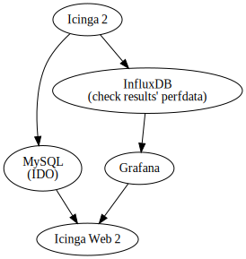

## About

The shipped [Dockerfile](./Dockerfile) assembles
[a full stack monitoring system][icinga] with [Nagio$ check plugin API] support
for testing and demonstrating such plugins.

### Components



* MySQL
* [InfluxDB]
* [Icinga 2]
  * writes to MySQL (IDO)
  * writes to InfluxDB (check results' perfdata)
* [Grafana]
  * reads from InfluxDB
* [Icinga Web 2]
  * monitoring module, reads from MySQL (IDO)
  * [Grafana module], embeds Grafana graphs (check results' perfdata)

## Usage

```
$ docker run -itp 8080:80 grandmaster/check-plugins-demo
```

Open http://localhost:8080.

### Use as base for the own check plugin's Docker image

See the already present plugins for example and inspiration:

* https://github.com/Al2Klimov/check_linux_newkernel
* https://github.com/Al2Klimov/check_systemd_needrestart

[icinga]: https://www.icinga.com/products/
[Nagio$ check plugin API]: https://nagios-plugins.org/doc/guidelines.html#AEN78
[InfluxDB]: https://www.influxdata.com/time-series-platform/influxdb/
[Icinga 2]: https://icinga.com/products/icinga-2/
[Grafana]: https://grafana.com/grafana
[Icinga Web 2]: https://icinga.com/products/icinga-web-2/
[Grafana module]: https://github.com/Mikesch-mp/icingaweb2-module-grafana
